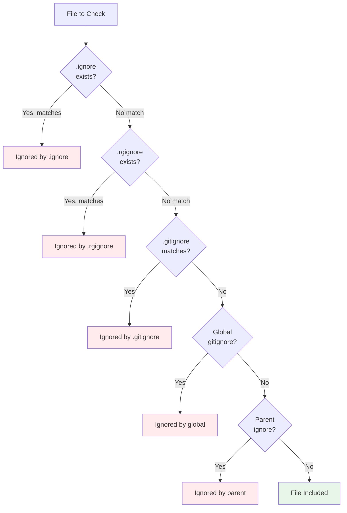
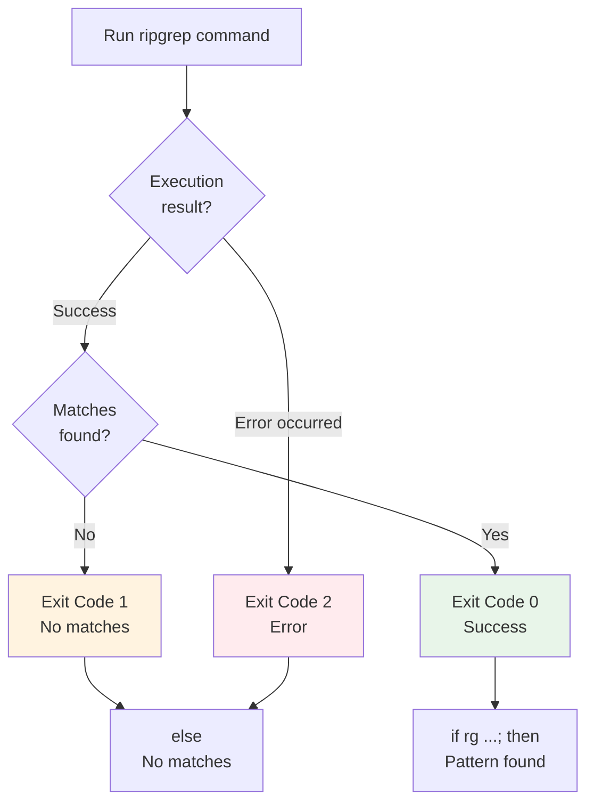

# Common Error Messages

## "pattern starts with a dash/hyphen"

!!! error "Error: unexpected argument found"
    When you try to search for text starting with `-`, ripgrep interprets it as a flag.

    ```bash
    $ rg -foo
    error: unexpected argument '-o' found
    ```

!!! tip "Solutions"
    Use `--` to separate flags from the pattern:

    ```bash
    $ rg -- -foo
    ```

    Or use `-e` to explicitly specify the pattern:

    ```bash
    $ rg -e -foo
    ```

## "Compiled regex exceeds size limit"

!!! error "Error: Compiled regex exceeds size limit"
    ```bash
    $ rg '\pL{1000}'
    Compiled regex exceeds size limit of 10485760 bytes.
    ```

    **Cause:** The regex pattern is too large when compiled. This often happens with large character classes (like `\pL` for all Unicode letters) or many alternations.

!!! tip "Solutions"
    Increase the limit with `--regex-size-limit`:

    ```bash
    $ rg '\pL{1000}' --regex-size-limit 1G
    ```

    Or simplify your pattern:

    ```bash
    $ rg '[a-zA-Z]{1000}'  # Use a smaller character class
    ```

## "DFA cache size limit exceeded"

!!! error "Error: DFA cache size limit exceeded"
    **Cause:** The DFA (Deterministic Finite Automaton) cache used by the regex engine has exceeded its memory limit (default: 1 MB). This can happen with complex patterns or large inputs.

!!! tip "Solutions"
    Increase the DFA cache size limit with `--dfa-size-limit`:

    ```bash
    $ rg "complex-pattern" --dfa-size-limit 10M
    ```

    Or simplify your regex pattern to reduce DFA cache usage.

## "Permission denied" or "Access denied"

!!! error "Error: Permission denied"
    ripgrep doesn't have permission to read certain files or directories.

!!! tip "Solutions"
    - Use `--no-messages` to suppress permission errors:

    ```bash
    $ rg "pattern" --no-messages
    ```

    - Run with appropriate permissions if you need to search protected files
    - Use `-u` or `-uu` flags carefully, as they don't bypass filesystem permissions

## "encoding error"

!!! error "Error: encoding error"
    The file contains bytes that aren't valid in the expected text encoding (usually UTF-8).

!!! tip "Solutions"
    - Use `-E/--encoding` to specify the correct encoding:

    ```bash
    $ rg "pattern" -E latin1
    ```

    - Use `-a/--text` to search the file anyway, treating it as text
    - See the [file encoding chapter](../file-encoding.md) for details

## Ignore File Issues

### Understanding Ignore Behavior

ripgrep respects multiple types of ignore files, in order of precedence:

1. `.ignore` (ripgrep-specific)
2. `.rgignore` (ripgrep-specific, deprecated)
3. `.gitignore` (version control)
4. Global gitignore (from Git configuration)
5. Parent directory ignore files



**Figure**: Ignore file precedence - earlier matches take priority and skip later checks.

### Diagnosing Ignore Problems

!!! tip "Use --debug for diagnostics"
    Use `--debug` to see which ignore files are being loaded and used:

    ```bash
    $ rg --debug "pattern"
    DEBUG|ignore::walk: ignoring ./node_modules: Ignore(IgnoreMatch(GitIgnore, .gitignore, node_modules/*, <...>))
    ```

### Bypassing Ignore Files

Different flags control different ignore behaviors:

=== "Unrestricted Levels (-u flags)"
    ```bash
    $ rg -u "pattern"             # (1)!
    $ rg -uu "pattern"            # (2)!
    $ rg -uuu "pattern"           # (3)!
    ```

    1. Ignore `.gitignore` but still respect `.ignore` files
    2. Ignore all ignore files but still skip hidden files and binaries
    3. Completely unrestricted search - search everything

=== "Selective Bypass"
    ```bash
    $ rg --no-ignore-vcs "pattern"      # (1)!
    $ rg --no-ignore-global "pattern"   # (2)!
    $ rg --no-ignore-parent "pattern"   # (3)!
    $ rg --no-ignore-messages "pattern" # (4)!
    ```

    1. Only ignore version control ignore files (`.gitignore`)
    2. Ignore global gitignore from Git configuration
    3. Ignore parent directory ignore files
    4. Suppress ignore-related error messages

### Parent Directory Ignore Files

Remember that `.gitignore` files in parent directories also affect the search. Use `--debug` to see all ignore files being used.

## Regex Pattern Errors

### Common Regex Mistakes

!!! warning "Unescaped special characters"
    ```bash
    $ rg "foo.bar"     # Matches "foo" + any char + "bar"
    $ rg "foo\.bar"    # Matches literal "foo.bar"
    $ rg -F "foo.bar"  # Literal search (no escaping needed)
    ```

!!! warning "Backreferences in default mode"
    ```bash
    $ rg "(\w+) \1"      # ERROR: backreferences not supported
    $ rg -P "(\w+) \1"   # OK: PCRE2 supports backreferences
    ```

!!! warning "Lookaround in default mode"
    ```bash
    $ rg "foo(?=bar)"    # ERROR: lookahead not supported
    $ rg -P "foo(?=bar)" # OK: PCRE2 supports lookahead
    ```

!!! note "Advanced regex features require PCRE2"
    For advanced regex features (backreferences, lookaround, etc.), you need PCRE2:

    ```bash
    $ rg -P "(?<=@)\w+"  # Use PCRE2 for lookbehind
    ```

See the FAQ in the project root (`FAQ.md`) for more information about regex engines.

### Pattern Too Complex

!!! tip "Strategies for complex patterns"
    If your pattern is complex and causing errors:

    1. **Simplify the pattern** - Break it into multiple simpler searches
    2. **Use literal search** - Try `-F` if you're searching for literal text
    3. **Increase limits** - Use `--regex-size-limit` if the pattern is large
    4. **Avoid PCRE2** - Try without `-P` to use the faster default engine

## Statistics Output

The `--stats` flag provides detailed information about the search:

```
$ rg "TODO" --stats
src/main.rs
12:    // TODO: implement this feature
25:    // TODO: add error handling

src/lib.rs
8:    // TODO: optimize this function

3 matches
3 matched lines
2 files contained matches
15 files searched
1234 bytes printed
45678 bytes searched
0.005123 seconds spent searching
0.001234 seconds
```

**Understanding the output:**
- **matches**: Total number of matches found
- **matched lines**: Total number of lines containing at least one match (may be less than total matches if a line contains multiple matches)
- **files contained matches**: How many files had at least one match
- **files searched**: Total files ripgrep examined
- **bytes searched**: Total bytes of content searched
- **seconds spent searching**: Time spent in the actual search algorithm
- **seconds**: Total wall clock time

!!! tip "Using --stats for diagnostics"
    Use `--stats` to:

    - Verify your search is running on the expected files
    - Diagnose performance issues (too many files searched)
    - Debug why you're getting zero results (check files searched count)

## PCRE2 Availability

!!! note "Checking PCRE2 support"
    If you're trying to use PCRE2 features with the `-P` flag and getting errors:

    **Check if PCRE2 is available:**

    ```bash
    $ rg --pcre2-version
    ```

    If PCRE2 is not available, you'll see an error. If it is available, you'll see version information and whether JIT (Just-In-Time compilation) is enabled:

    ```bash
    PCRE2 10.42 is available (JIT is available)
    ```

!!! warning "If PCRE2 is not available"
    - Your ripgrep binary wasn't compiled with PCRE2 support
    - Install a version with PCRE2 support, or build from source with the `pcre2` feature

## Exit Codes

!!! note "Understanding exit codes"
    ripgrep uses exit codes to indicate search results, which is useful in scripts:

    - **Exit 0**: At least one match was found
    - **Exit 1**: No matches found (not an error)
    - **Exit 2**: An error occurred



**Figure**: Exit code logic - use in scripts with `if` statements to handle different outcomes.

!!! example "Example usage in scripts"
    ```bash
    if rg -q "pattern" file.txt; then
        echo "Pattern found"
    else
        echo "Pattern not found or error occurred"
    fi
    ```

    The `-q/--quiet` flag suppresses output and is useful with exit codes for conditional logic.
