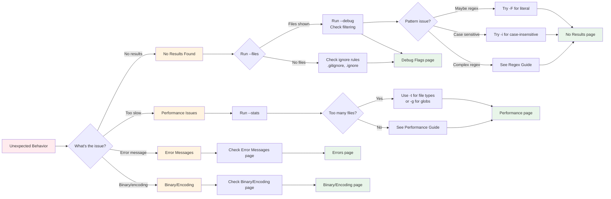

# Troubleshooting

This chapter helps you diagnose and solve common problems when using ripgrep. Most issues can be resolved by understanding ripgrep's filtering behavior and using the `--debug` flag to see what's happening behind the scenes.

## Most Common Issues

=== "No Results Found"
    **Symptom**: Search returns no matches when you expect results.

    **Quick Fix**:
    ```bash
    # Check which files would be searched
    rg --files | head -20  # (1)!

    # See detailed filtering info
    rg --debug pattern 2>&1 | head -30  # (2)!

    # Try unrestricted search
    rg -uuu pattern  # (3)!
    ```

    1. Shows first 20 files that would be searched. If your target files aren't listed, they're being filtered out.
    2. Displays debug output showing which files are searched and which are ignored.
    3. Disables all filtering including gitignore, hidden files, and binary detection.

    **→** See [No Results Found](./no-results.md) for detailed guidance.

=== "Too Slow"
    **Symptom**: Search takes longer than expected.

    **Quick Fix**:
    ```bash
    # Check search statistics
    rg --stats pattern  # (1)!

    # Limit to specific file types
    rg -tpy pattern  # (2)!

    # Use glob patterns
    rg -g '*.py' pattern  # (3)!
    ```

    1. Shows number of files searched, bytes searched, and time taken.
    2. Searches only Python files using built-in type filter.
    3. Searches only files matching the glob pattern.

    **→** See [Performance Issues](./performance.md) for optimization strategies.

=== "Error Messages"
    **Symptom**: Ripgrep exits with an error.

    **Quick Fix**:
    ```bash
    # Common regex syntax errors
    rg 'pattern('  # Missing closing parenthesis
    # Error: regex parse error

    # Try literal search if pattern is complex
    rg -F 'pattern('  # (1)!

    # Check encoding issues
    rg --encoding=auto pattern  # (2)!
    ```

    1. The `-F` flag treats your pattern as literal text, not regex.
    2. Automatically detects file encoding instead of assuming UTF-8.

    **→** See [Common Error Messages](./errors.md) for detailed solutions.

=== "Binary/Encoding"
    **Symptom**: Files skipped as binary or garbled output.

    **Quick Fix**:
    ```bash
    # Search binary files
    rg -a pattern  # (1)!

    # Specify encoding
    rg --encoding=latin1 pattern  # (2)!

    # Show binary file detection
    rg --debug pattern 2>&1 | grep -i binary  # (3)!
    ```

    1. Treats binary files as text and searches them.
    2. Uses Latin-1 encoding instead of default UTF-8.
    3. Shows which files are detected as binary and why.

    **→** See [Binary and Encoding Problems](./binary-encoding.md) for more details.

## Quick Troubleshooting Checklist

!!! tip "Diagnostic Steps"
    If you're experiencing unexpected behavior, try these steps in order:

    1. **Run with `--files`** to see which files would be searched (without actually searching)
    2. **Run with `--debug`** to see what files are being searched and why others are skipped
    3. **Try `-uuu`** (unrestricted search) to temporarily disable all filtering
    4. **Use `-F`** to search for literal text instead of a regex pattern
    5. **Try `-i`** to make the search case-insensitive
    6. **Check `--stats`** to see how many files were searched and matches found
    7. **Review the [Basics](../basics/index.md)** for fundamental concepts

!!! warning "Be Careful with Unrestricted Search"
    The `-uuu` flag disables all filtering including gitignore rules, hidden files, and binary detection. This can make ripgrep search thousands of unwanted files (like `node_modules/`, `.git/`, build artifacts) and significantly slow down your search. Use it only for diagnostic purposes to confirm filtering is the issue, then use more targeted flags like `-uu` or specific `--no-ignore` options.

## Troubleshooting Decision Flow



**Figure**: Troubleshooting decision flow showing how to diagnose common issues and navigate to the relevant guide section.

!!! note "How to Use This Guide"
    **Quick fix needed?** Check the [Most Common Issues](#most-common-issues) section above for tabbed examples with annotated commands.

    **New to troubleshooting?** Follow the decision flow diagram above to identify your issue and get diagnostic steps.

    **Know your issue category?** Jump directly to the relevant detailed guide using the navigation links below.

## Navigation

This troubleshooting guide is organized into several focused sections:

- **[Debug Flags](./debug-flags.md)** - Understanding `--debug`, `--trace`, and `--stats` flags
- **[No Results Found](./no-results.md)** - Diagnosing why you're getting no search results
- **[Performance Issues](./performance.md)** - Optimizing ripgrep search speed
- **[Common Error Messages](./errors.md)** - Understanding and fixing error messages
- **[Binary and Encoding Problems](./binary-encoding.md)** - Handling binary files and encoding issues
- **[When to File a Bug](./bug-reports.md)** - Preparing good bug reports and getting help

## Related Resources

- **Basics**: Learn fundamental concepts - [Basics Guide](../basics/index.md)
- **Common Options**: See frequently used options - [Common Options Reference](../common-options/reference.md)
- **Configuration**: See the [configuration file chapter](../configuration-file.md) for persistent settings
- **File Encoding**: See the [file encoding chapter](../file-encoding.md) for encoding details

!!! question "Still Stuck?"
    If you've tried the troubleshooting steps and still can't resolve your issue, check the [bug reports page](./bug-reports.md) for guidance on how to file a detailed bug report and get help from the community.
