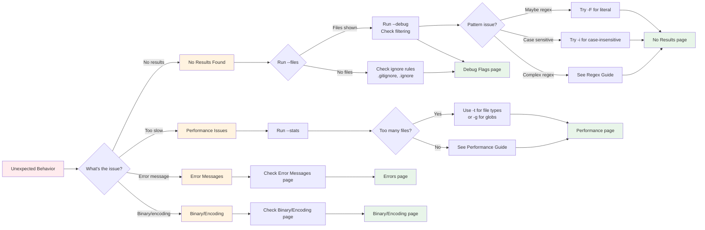

# Troubleshooting

This chapter helps you diagnose and solve common problems when using ripgrep. Most issues can be resolved by understanding ripgrep's filtering behavior and using the `--debug` flag to see what's happening behind the scenes.

## Quick Troubleshooting Checklist

!!! tip "Quick Troubleshooting Steps"
    If you're experiencing unexpected behavior, try these steps in order:

    1. **Run with `--files`** to see which files would be searched (without actually searching)
    2. **Run with `--debug`** to see what files are being searched and why others are skipped
    3. **Try `-uuu`** (unrestricted search) to temporarily disable all filtering
    4. **Use `-F`** to search for literal text instead of a regex pattern
    5. **Try `-i`** to make the search case-insensitive
    6. **Check `--stats`** to see how many files were searched and matches found
    7. **Review the [Basics](../basics/index.md)** for fundamental concepts

## Troubleshooting Decision Flow

**Figure**: Troubleshooting decision flow showing how to diagnose common issues and navigate to the relevant guide section.

!!! note "How to Use This Guide"
    **New to troubleshooting?** Follow the decision flow diagram above to identify your issue and get quick diagnostic steps.

    **Know your issue category?** Jump directly to the relevant section using the navigation links below.

## Navigation

This troubleshooting guide is organized into several focused sections:

- **[Debug Flags](./debug-flags.md)** - Understanding `--debug`, `--trace`, and `--stats` flags
- **[No Results Found](./no-results.md)** - Diagnosing why you're getting no search results
- **[Performance Issues](./performance.md)** - Optimizing ripgrep search speed
- **[Common Error Messages](./errors.md)** - Understanding and fixing error messages
- **[Binary and Encoding Problems](./binary-encoding.md)** - Handling binary files and encoding issues
- **[When to File a Bug](./bug-reports.md)** - Preparing good bug reports and getting help

## Related Resources

- **Basics**: Learn fundamental concepts - [Basics Guide](../basics/index.md)
- **Common Options**: See frequently used options - [Common Options Reference](../common-options/reference.md)
- **Configuration**: See the [configuration file chapter](../configuration-file.md) for persistent settings
- **File Encoding**: See the [file encoding chapter](../file-encoding.md) for encoding details

!!! question "Still Stuck?"
    If you've tried the troubleshooting steps and still can't resolve your issue, check the [bug reports page](./bug-reports.md) for guidance on how to file a detailed bug report and get help from the community.
