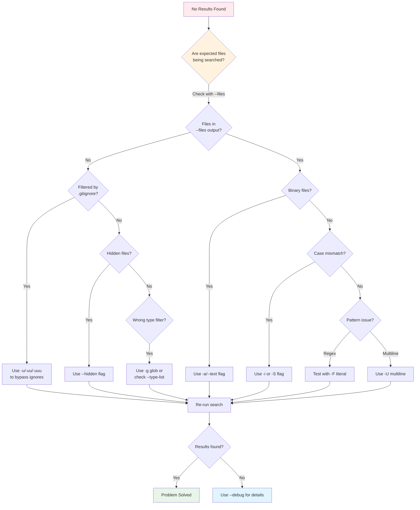
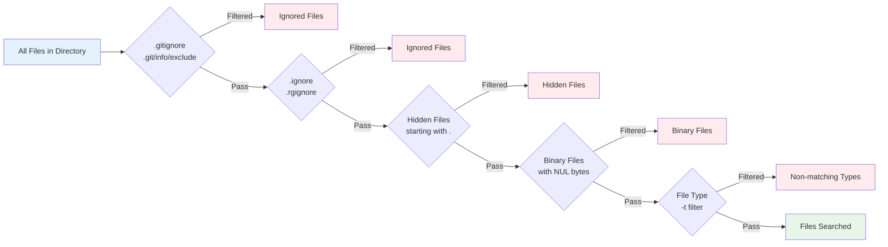

# No Results Found

If ripgrep returns zero results when you expect matches, try these troubleshooting steps:



**Figure**: Diagnostic decision tree for troubleshooting "no results" issues.

## Check What Files Would Be Searched

!!! tip "Primary Diagnostic Tool: `--files`"
    **First step:** Use the `--files` flag to see which files ripgrep would search (without actually searching them):

    ```bash
    $ rg --files
    ```

    This diagnostic flag is crucial for understanding filtering issues. If your expected files aren't in this list, they're being filtered out.

!!! example "Combine `--files` with other filters"
    ```bash
    $ rg --files -t rust           # See which Rust files would be searched
    $ rg --files -g "*.config"     # See which .config files would be searched
    $ rg --files --hidden          # Include hidden files in the listing
    ```

## Files Filtered by .gitignore

!!! warning "Default Behavior: `.gitignore` Respected"
    ripgrep respects `.gitignore` by default and won't search ignored files. This is usually what you want, but can cause confusion when looking for files in `node_modules/`, `target/`, or other ignored directories.

**Diagnosis:** Run with `--debug` to see if files are being ignored (see [Debug Flags](./debug-flags.md) for more details):

```bash
# Source: docs/troubleshooting/debug-flags.md
$ rg --debug "pattern"
DEBUG|ignore::walk: ignoring ./node_modules: Ignore(IgnoreMatch(...))  # (1)!
```

1. This line shows that `node_modules/` is being ignored due to a `.gitignore` match. The path and reason are shown for each filtered file/directory.



**Figure**: ripgrep's filtering layers - files must pass all filters to be searched.

**Solutions:**

=== "-u (bypass .gitignore)"
    ```bash
    $ rg -u "pattern"
    ```

    Ignores `.gitignore` and `.git/info/exclude`, but still respects:

    - `.ignore` and `.rgignore` files
    - Hidden file filtering (files starting with `.`)
    - Binary file filtering (files with NUL bytes)

=== "-uu (bypass all ignore files)"
    ```bash
    $ rg -uu "pattern"
    ```

    Ignores all ignore files (`.gitignore`, `.ignore`, `.rgignore`), but still respects:

    - Hidden file filtering (files starting with `.`)
    - Binary file filtering (files with NUL bytes)

=== "-uuu (unrestricted)"
    ```bash
    $ rg -uuu "pattern"
    ```

    Completely unrestricted search - searches everything:

    - Ignores all ignore files
    - Searches hidden files
    - Searches binary files

=== "--no-ignore-vcs (VCS only)"
    ```bash
    $ rg --no-ignore-vcs "pattern"
    ```

    Ignores only version control ignore files (`.gitignore`, `.git/info/exclude`), but still respects:

    - `.ignore` and `.rgignore` files
    - Hidden file filtering
    - Binary file filtering

## Hidden Files Skipped

**Problem:** ripgrep skips hidden files and directories (those starting with `.`) by default.

**Solutions:**
- Use `--hidden` to search hidden files
- Use `-uuu` to search everything including hidden files

## Binary Files Filtered

!!! note "Binary File Detection"
    ripgrep automatically detects and skips binary files to avoid printing garbage to your terminal. It does this by checking if the file contains a NUL byte (`\0`) within the first few KB of the file.

For more details, see the [Binary and Encoding Problems](./binary-encoding.md) page.

**Diagnosis:** Run with `--debug` to see binary file detection:

```bash
# Source: docs/troubleshooting/debug-flags.md
$ rg --debug "pattern"
DEBUG|grep_searcher::searcher: binary file matches (but not printed): ./myfile.bin  # (1)!
```

1. This indicates the file was searched and matches were found, but results weren't printed because a NUL byte was detected in the first few KB of the file.

**Solutions:**

- Use `-a` or `--text` to search binary files anyway
- Use `--binary` to explicitly control binary file handling

## Case Sensitivity

**Problem:** The pattern doesn't match because of case differences.

**Solutions:**
- Use `-i` or `--ignore-case` to make the search case-insensitive
- Use `-S` or `--smart-case` to search case-insensitively if the pattern is all lowercase
- Check if smart-case is enabled in your configuration file

## File Type Not Recognized

**Problem:** Files are being filtered out because their type isn't recognized or matched by your `-t` filter.

**Diagnosis:** Use `--type-list` to see all file types ripgrep knows about:

```bash
$ rg --type-list
```

This shows all available file types and their associated patterns. Check if your file type is listed and what extensions/patterns it matches.

!!! example "Checking available file types"
    ```bash
    $ rg --type-list | grep -i rust
    rust: *.rs

    $ rg --type-list | grep -i python
    py: *.py, *.pyw, *.pyi, *.pyx
    ```

**Solutions:**

- If your file type isn't in the list, use `-g` glob patterns instead of `-t`:
  ```bash
  $ rg "pattern" -g "*.myext"
  ```
- Check that you're using the correct type name (e.g., `py` not `python`)
- Add custom file types in your configuration file using `--type-add`:

!!! example "Adding custom file types"
    Create or edit `~/.ripgreprc` (or `$RIPGREP_CONFIG_PATH`):

    ```conf
    # Source: docs/configuration-file.md
    # Add custom type for web development
    --type-add
    web:*.{html,css,js,jsx,ts,tsx}*

    # Add custom type for configuration files
    --type-add
    config:*.{json,yaml,yml,toml,ini}*
    ```

    Then use your custom types:
    ```bash
    $ rg "pattern" -t web      # Search only web files
    $ rg "pattern" -t config   # Search only config files
    ```

    For more details, see [Configuration File](../configuration-file.md) and [File Type Filtering](../manual-filtering-types.md).

## Pattern Doesn't Match

**Problem:** Your regex pattern isn't matching what you expect.

**Diagnosis:**

- Use `-F` or `--fixed-strings` to search for literal text instead of a regex
- Test with a simpler pattern to verify the file is being searched
- Use `--debug` to see the literal prefixes ripgrep extracted from your pattern

!!! example "Testing literal vs regex search"
    ```bash
    $ rg "foo.*bar"      # regex search (matches "foo123bar", "fooXYZbar", etc.)
    $ rg -F "foo.*bar"   # literal search for the exact string "foo.*bar"
    ```

!!! tip "Multiline Patterns"
    By default, patterns match within single lines only. If you need to match patterns that span multiple lines, use multiline mode:

    ```bash
    # Source: docs/common-options/search-basics.md
    # Match function definitions spanning multiple lines
    $ rg -U 'fn \w+\([^)]*\)\s*->'

    # Find multi-line comments
    $ rg -U '/\*.*?\*/'
    ```

    **Note:** In multiline mode (`-U`), the `.` metacharacter still doesn't match newlines by default. Use `--multiline-dotall` to make `.` match `\n`:

    ```bash
    # Match struct definitions with any content between braces
    $ rg -U --multiline-dotall 'struct \w+ \{.*?\}'
    ```

    For more details, see [Search Basics](../common-options/search-basics.md#multiline-matching).

## See Also

- [Debug Flags](./debug-flags.md) - Comprehensive guide to diagnostic flags
- [Binary and Encoding Problems](./binary-encoding.md) - Troubleshooting binary file and encoding issues
- [Search Basics](../common-options/search-basics.md) - Pattern matching fundamentals
- [Configuration File](../configuration-file.md) - Setting up custom file types and default options
