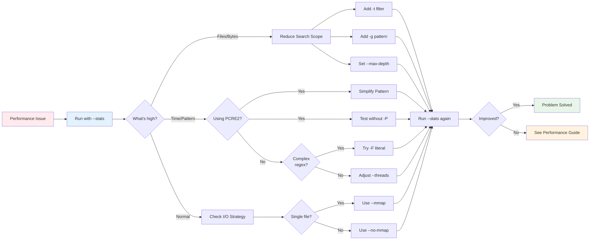

# Performance Issues

If ripgrep is slower than expected, try these diagnostic and optimization steps:

!!! tip "Quick Performance Wins"
    1. **Use literal search** with `-F` when not needing regex - significantly faster
    2. **Use file type filters** (`-t`) to limit search space
    3. **Skip large files** with `--max-filesize`
    4. **Prefer default engine** over PCRE2 unless you need lookaround/backreferences

!!! note "Detailed Performance Guide"
    For comprehensive performance information including multiline mode, PCRE2 engine details, I/O strategies, and regex limits, see [Performance Considerations](../advanced-patterns/performance.md).

## Use --stats to Diagnose

Always start by running with `--stats` to see what ripgrep is actually doing:

```bash
$ rg "pattern" --stats
10000 files searched
5 MB searched
2.5 seconds spent searching
```

If you see an unexpectedly large number of files or bytes, you need to filter more aggressively.



**Figure**: Performance troubleshooting diagnostic flowchart.

## Reduce Search Scope

**Filter by file type:**

```bash
$ rg "pattern" -t rust  # Only search Rust files
$ rg "pattern" -g "*.rs"  # Use glob pattern
```

**Exclude directories:**

```bash
$ rg "pattern" -g "!vendor/*"  # Exclude vendor directory
```

## Avoid Complex PCRE2 Patterns

**Problem:** PCRE2 regexes (`-P` flag) can be much slower than ripgrep's default regex engine.

**Why it's slow:** PCRE2 uses backtracking, which can have exponential time complexity on certain patterns and inputs. ripgrep's default engine uses finite automata with guaranteed linear time.

!!! warning "PCRE2 Backtracking Risk"
    PCRE2 patterns can cause exponential time complexity with nested quantifiers like `(a+)+` or `(.*)*`. This can lead to extremely slow searches or even appear to hang on large files. Always test PCRE2 patterns on representative data before using in production scripts.

**Specific pathological patterns to avoid:**
- Nested quantifiers: `(a+)+`, `(.*)*`
- Complex alternations with overlapping possibilities
- Patterns that cause extensive backtracking on non-matches

**When PCRE2 is worth using:**
- Need lookaround (`(?=...)`, `(?!...)`) or backreferences
- Pattern complexity requires PCRE2 features
- Search space is limited (specific files/directories)
- You've tested the pattern on representative data and performance is acceptable

**Solutions:**
- Avoid `-P/--pcre2` unless you specifically need features like lookaround or backreferences
- If using PCRE2, simplify your regex pattern
- Test without `-P` to see if the default engine is faster
- See [Performance Considerations](../advanced-patterns/performance.md#pcre2-engine-performance) for detailed PCRE2 performance information

## Adjust Threading

By default, ripgrep uses multiple threads. You can adjust this:

```bash
$ rg "pattern" --threads 4  # Limit to 4 threads
$ rg "pattern" -j 1  # Single-threaded search
```

!!! note
    Some flags like `--sort` automatically disable parallelism to maintain order.

## Memory Mapping Strategy

Ripgrep automatically selects the best I/O strategy:

- **Memory mapping** (`mmap`): Used for single file searches
    - Maps file directly into memory
    - Faster for large files
    - Lower memory overhead
- **Buffered reading**: Used for directory searches
    - Reads files incrementally
    - Better for many small files
    - More predictable memory usage

!!! note "Platform-Specific Behavior"
    Memory mapping behavior differs by platform:

    === "macOS"
        Memory mapping is **disabled by default** due to platform-specific performance characteristics. Ripgrep uses buffered reading for both single-file and directory searches.

        ```bash
        # Use --mmap only if profiling shows benefit
        $ rg "pattern" --mmap file.txt
        ```

    === "Linux / Windows"
        Memory mapping is **enabled by default** for single-file searches. Ripgrep automatically uses the optimal strategy.

        ```bash
        # Automatically uses mmap for single files
        $ rg "pattern" largefile.log
        ```

!!! tip "Let Ripgrep Choose Automatically"
    Ripgrep's automatic I/O selection is optimized for most use cases. Only override with `--mmap` or `--no-mmap` if you've identified a specific performance issue through profiling with `--stats`.

**Manual control if needed:**

```bash
$ rg "pattern" --mmap      # (1)!
$ rg "pattern" --no-mmap   # (2)!
```

1. Force memory mapping - use for large single-file searches
2. Force buffered reading - use when memory mapping causes issues

## Performance Tuning Flags

<!-- Source: docs/advanced-patterns/performance.md:199-231 -->

**Skip large files:**
```bash
$ rg --max-filesize 10M 'pattern'  # (1)!
```

1. Ignores files larger than 10MB - useful for avoiding slow searches through large binary files or logs

**Handle long lines:**
```bash
$ rg --max-columns 500 'pattern'  # (1)!
```

1. Ignores lines longer than 500 characters - prevents slow regex matching on extremely long lines like minified code

**Stop after N matches:**
```bash
$ rg --max-count 100 'pattern'  # (1)!
```

1. Stops after finding 100 matches - useful for quick verification or when you only need a few examples

**Limit recursion depth:**
```bash
$ rg --max-depth 3 'pattern'  # (1)!
```

1. Limits how deep ripgrep will recurse into directories

**Avoid crossing filesystem boundaries:**
```bash
$ rg --one-file-system 'pattern'  # (1)!
```

1. Prevents searching across mount points - avoids accidentally searching network drives or external disks

**Configure regex engine limits:**
```bash
# Source: crates/core/flags/defs.rs:1504-1578, 5762-5801
$ rg --dfa-size-limit 50M 'pattern'    # (1)!
$ rg --regex-size-limit 50M 'pattern'  # (2)!
```

1. Increase DFA memory limit - controls memory usage for the deterministic finite automaton. Ripgrep sets a generous default limit suitable for most patterns; increase this for very large regex inputs to avoid falling back to slower engines.
2. Increase regex compilation size - controls the size of the compiled regex matcher in memory. Ripgrep's default is generous for reasonable patterns; raise if you encounter "regex too large" errors with many patterns.

## Testing and Profiling

!!! example "Performance Testing Workflow"
    ```bash
    # Test with stats on representative data
    $ rg --stats 'pattern' > /dev/null

    # Compare different approaches
    $ time rg -F 'literal' > /dev/null
    $ time rg 'regex' > /dev/null

    # Profile complex patterns before production use
    $ rg --stats -P 'complex.*pattern' testdata/
    ```

**Best practices:**
- Test with `--stats` flag to see performance metrics
- Profile complex patterns before using in production scripts
- Use `time` command for comparing different approaches
- Test on your actual datasets, not toy examples
- Always test PCRE2 patterns on representative data
