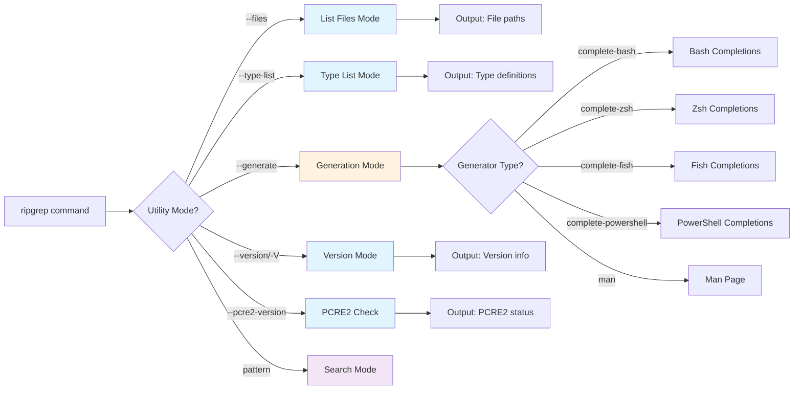

# Utility Modes

Beyond pattern searching, ripgrep provides several utility modes for discovery, shell integration, and diagnostics. These modes help you explore available features, generate shell completions, and integrate ripgrep into your development workflow.

## Overview

Utility modes are special operating modes where ripgrep doesn't search for patterns but instead provides information or generates configuration files. These modes are essential for:

- Discovering which files would be searched
- Listing available file types
- Generating shell completions
- Creating man pages
- Checking version and feature availability



**Figure**: Utility mode selection flow showing how flags determine ripgrep's operating mode.

## Files Mode

The `--files` flag lists all files that ripgrep would search, without performing any pattern matching.

### Basic Usage

```bash
# List all files that would be searched
rg --files

# List files in specific directory
rg --files /path/to/directory
```

### Use Cases

!!! tip "Best Practice"
    Always use `--files` to preview search scope before running expensive queries on large codebases. This helps verify your filters are working correctly.

**Preview Search Scope:**
```bash
# See what files will be searched before running actual search
rg --files | wc -l
```

**Verify File Filtering:**
```bash
# Check which files match your type filter
rg --files -t rust

# Verify ignore rules are working
rg --files --no-ignore
```

**Generate File Lists:**
```bash
# Create a file inventory
rg --files > project-files.txt

# Find files modified recently (combine with other tools)
rg --files | xargs ls -lt | head -20
```

**Pipe to Other Tools:**
```bash
# Count lines in all searchable files
rg --files | xargs wc -l

# Find largest files in project
rg --files | xargs du -h | sort -rh | head -10
```

### Combining with Filters

The `--files` mode respects all filtering options:

```bash
# List only Python files
rg --files -t py

# List files matching glob pattern
rg --files -g '*.json'

# List files including hidden ones
rg --files --hidden

# List files ignoring .gitignore
rg --files --no-ignore
```

!!! note "Flag Precedence"
    The `--files` flag takes precedence over `--type-list`. If you specify both flags, ripgrep will list files rather than displaying type definitions.

    Source: `crates/core/flags/defs.rs:2151`

## Type List Mode

The `--type-list` flag displays all built-in file type definitions.

### Basic Usage

```bash
# Show all file types
rg --type-list
```

### Output Format

Each line shows a file type and its associated glob patterns:

```
rust: *.rs
python: *.py, *.pyw, *.pyi, *.pyx
javascript: *.js, *.jsx, *.mjs
go: *.go
```

### Use Cases

!!! tip "Discovering Types"
    Use `--type-list | grep` to find the correct type name for your language instead of guessing. This ensures your `-t` filters work correctly.

**Discover Available Types:**
```bash
# Find file type for your language
rg --type-list | grep -i java
```

**Verify Custom Types:**
```bash
# Check if custom type is defined
rg --type-list | grep mytype
```

**Reference for Type Filters:**
```bash
# See all types to use with -t flag
rg --type-list | less
```

### Custom Type Definitions

Add custom types and verify them:

```bash
# Add custom type
rg --type-add 'config:*.{yml,yaml,toml,json}' --type-list | grep config

# Use custom type
rg --type-add 'config:*.{yml,yaml,toml}' -t config 'database_url'
```

!!! example "Custom Type Verification"
    The `--type-list` output reflects any custom types added via `--type-add` and respects `--type-clear` if used to remove built-in types. This makes it useful for verifying your type configuration:

    ```bash
    # Clear all types and add only custom ones
    rg --type-clear --type-add 'web:*.{html,css,js}' --type-list

    # Verify custom type is available
    rg --type-add 'config:*.{yml,yaml}' --type-list | grep config
    ```

## Generation Mode

The `--generate` flag creates shell completions and man pages for ripgrep. All generated output is written to stdout, allowing you to pipe or redirect it as needed.

### Supported Shells

ripgrep can generate completions for:

- Bash (`complete-bash`)
- Zsh (`complete-zsh`)
- Fish (`complete-fish`)
- PowerShell (`complete-powershell`)
- Man pages (`man`)

Source: `crates/core/flags/defs.rs:2454-2458`, `crates/core/main.rs:359-365`

### Generating Shell Completions

=== "Bash"
    ```bash
    # Generate Bash completions
    rg --generate complete-bash

    # Install system-wide (Linux)
    rg --generate complete-bash | sudo tee /usr/share/bash-completion/completions/rg

    # Install user-local (macOS with Homebrew)
    rg --generate complete-bash > $(brew --prefix)/etc/bash_completion.d/rg
    ```

=== "Zsh"
    ```bash
    # Generate Zsh completions
    rg --generate complete-zsh

    # Install in fpath (common location)
    rg --generate complete-zsh > ~/.zsh/completion/_rg

    # Or system-wide
    sudo rg --generate complete-zsh > /usr/local/share/zsh/site-functions/_rg
    ```

=== "Fish"
    ```bash
    # Generate Fish completions
    rg --generate complete-fish

    # Install user-local
    rg --generate complete-fish > ~/.config/fish/completions/rg.fish
    ```

=== "PowerShell"
    ```powershell
    # Generate PowerShell completions
    rg --generate complete-powershell

    # Add to profile
    rg --generate complete-powershell >> $PROFILE
    ```

### Generating Man Pages

```bash
# Generate man page
rg --generate man

# Install system-wide
rg --generate man | sudo tee /usr/local/share/man/man1/rg.1

# View generated man page
rg --generate man | man -l -
```

### Installation Workflow

!!! example "Complete Shell Integration"
    Complete shell integration setup for Zsh:

    ```bash
    # Example: Zsh installation
    mkdir -p ~/.zsh/completion
    rg --generate complete-zsh > ~/.zsh/completion/_rg

    # Add to .zshrc if not already present
    echo 'fpath=(~/.zsh/completion $fpath)' >> ~/.zshrc
    echo 'autoload -Uz compinit && compinit' >> ~/.zshrc

    # Reload shell
    exec zsh
    ```

## Version Information

Check ripgrep version and feature availability.

### Version Flag

```bash
# Show version (verbose output)
rg --version

# Short form (compact output)
rg -V
```

**Example output from `rg --version`:**
```
ripgrep 14.1.0             # (1)!
-SIMD -AVX (compiled)      # (2)!
+SIMD +AVX (runtime)       # (3)!
```

1. Version number of the ripgrep binary
2. Features available at compile time (prefixed with + or -)
3. CPU features detected at runtime on your system

!!! tip "Version Flag Usage"
    The `--version` flag provides more verbose output including feature information, while `-V` provides a more compact version string. Use `--version` when you need to check feature support, and `-V` when you only need the version number.

### PCRE2 Version Check

Verify PCRE2 support and JIT compilation:

```bash
# Check PCRE2 availability
rg --pcre2-version
```

**Example output:**
```
PCRE2 10.42 is available (JIT is available)
```

This confirms:
- PCRE2 library version
- Whether JIT (Just-In-Time) compilation is enabled
- Feature availability for advanced regex patterns

Source: `crates/core/main.rs:392-399`

### Use Cases

!!! tip "Check Before Using PCRE2"
    Always verify PCRE2 is available before using advanced regex features in scripts. This prevents runtime errors on systems without PCRE2 support.

**Check Feature Availability:**
```bash
# Verify PCRE2 before using advanced patterns
if rg --pcre2-version &>/dev/null; then
  rg -P 'pattern(?=lookahead)'
else
  echo "PCRE2 not available"
fi
```

**Version-Specific Behavior:**
```bash
# Check version for compatibility
version=$(rg --version | head -n1 | awk '{print $2}')
echo "Using ripgrep version: $version"
```

## Practical Examples

### Example 1: Audit Project Structure

Get a quick overview of your codebase composition by counting files per language:

```bash
# Count files by type
echo "Rust files:" $(rg --files -t rust | wc -l)        # (1)!
echo "Python files:" $(rg --files -t py | wc -l)        # (2)!
echo "JavaScript files:" $(rg --files -t js | wc -l)    # (3)!
echo "Total files:" $(rg --files | wc -l)               # (4)!
```

1. Count Rust source files (*.rs) using type filter
2. Count Python files (*.py, *.pyw, *.pyi)
3. Count JavaScript files (*.js, *.jsx, *.mjs)
4. Count all searchable files respecting ignore rules

### Example 2: Find Large Files

Identify large files that might need optimization or exclusion from searches:

```bash
# List largest files in project
rg --files | xargs du -h | sort -rh | head -20    # (1)!
```

1. Pipeline: list searchable files → get sizes → sort by size (largest first) → show top 20

### Example 3: Verify Search Coverage

Understand how many files are being filtered by ignore rules:

```bash
# Compare total files vs searched files
total=$(find . -type f | wc -l)                    # (1)!
searched=$(rg --files | wc -l)                     # (2)!
echo "Total files: $total"
echo "Searched files: $searched"
echo "Filtered: $((total - searched))"             # (3)!
```

1. Count all files in directory tree (no filtering)
2. Count files ripgrep would search (respects .gitignore, etc.)
3. Calculate how many files are being filtered out

### Example 4: Generate File Inventory

Create a machine-readable inventory for build systems or analysis tools:

```bash
# Create JSON inventory of searchable files
rg --files | jq -R . | jq -s '{files: .}' > inventory.json    # (1)!
```

1. Convert file list to JSON array: read lines → wrap each as JSON string → collect into array → save

### Example 5: Setup Development Environment

```bash
# Complete shell integration setup script
#!/bin/bash

# Install completions                                                    # (1)!
completion_dir="$HOME/.local/share/bash-completion/completions"         # (2)!
mkdir -p "$completion_dir"                                              # (3)!
rg --generate complete-bash > "$completion_dir/rg"                      # (4)!

# Install man page                                                       # (5)!
man_dir="$HOME/.local/share/man/man1"                                   # (6)!
mkdir -p "$man_dir"                                                     # (7)!
rg --generate man > "$man_dir/rg.1"                                     # (8)!

# Update man database                                                    # (9)!
mandb "$HOME/.local/share/man"                                          # (10)!

echo "ripgrep shell integration installed"
```

1. Set up shell completions for tab completion in bash
2. Define user-local completion directory (no sudo required)
3. Create completion directory if it doesn't exist
4. Generate and save bash completions to the directory
5. Set up man page for offline documentation access
6. Define user-local man page directory (section 1 for user commands)
7. Create man directory structure if needed
8. Generate and save man page in roff format
9. Update the man page index database
10. Run mandb to make the new man page searchable with `man rg`

## Integration with Development Workflows

### Editor Integration

Many editors use `rg --files` for file discovery:

```bash
# Vim/Neovim with fzf
" Use ripgrep for file finding
let $FZF_DEFAULT_COMMAND = 'rg --files'

# VS Code uses ripgrep by default
# Configure search exclusions in settings.json
```

### CI/CD Pipelines

```bash
# Verify expected files exist
if ! rg --files | grep -q 'README.md'; then
  echo "ERROR: README.md missing"
  exit 1
fi

# Count TODOs in codebase
todo_count=$(rg 'TODO|FIXME' --count | awk -F: '{sum+=$2} END {print sum}')
echo "TODOs in codebase: $todo_count"
```

### Build Scripts

```bash
# Generate file list for build system
rg --files -t rust | sed 's/^/src\//' > build/sources.txt

# Find all test files
rg --files -g '*_test.go' > test-files.txt
```

## Best Practices

- Use `--files` to preview search scope before running expensive queries
- Check `--type-list` to discover available file types instead of guessing
- Generate and install shell completions for better command-line experience
- Use `--pcre2-version` to verify feature availability in scripts
- Combine `--files` with other Unix tools for powerful file analysis
- Install man pages locally for offline reference

## Troubleshooting

### Completions Not Working

!!! warning "Common Issue"
    **Problem**: Shell completions not activated after generation

    **Solutions**:

    - Verify completion file is in correct directory
    - Check that completion system is enabled in shell
    - Restart shell or source configuration file
    - Verify file permissions (should be readable)

### Files Mode Showing Unexpected Results

!!! warning "Unexpected File Count"
    **Problem**: `--files` shows more/fewer files than expected

    **Solutions**:

    - Check ignore files (`.gitignore`, `.ignore`)
    - Verify `--hidden` or `--no-ignore` flags if needed
    - Test with different type filters to isolate issue

### PCRE2 Not Available

!!! warning "PCRE2 Missing"
    **Problem**: `--pcre2-version` returns error

    **Solutions**:

    - Verify ripgrep was compiled with PCRE2 support
    - Check ripgrep installation method (some packages exclude PCRE2)
    - Consider reinstalling from source with PCRE2 enabled

## See Also

- [Common Options](common-options/index.md) - Frequently used flags
- [Manual Filtering: File Types](manual-filtering-types.md) - File type filtering details
- [Troubleshooting](troubleshooting/index.md) - General troubleshooting guide
